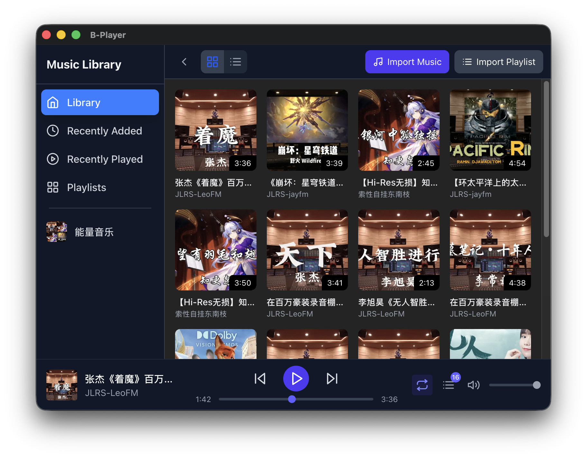
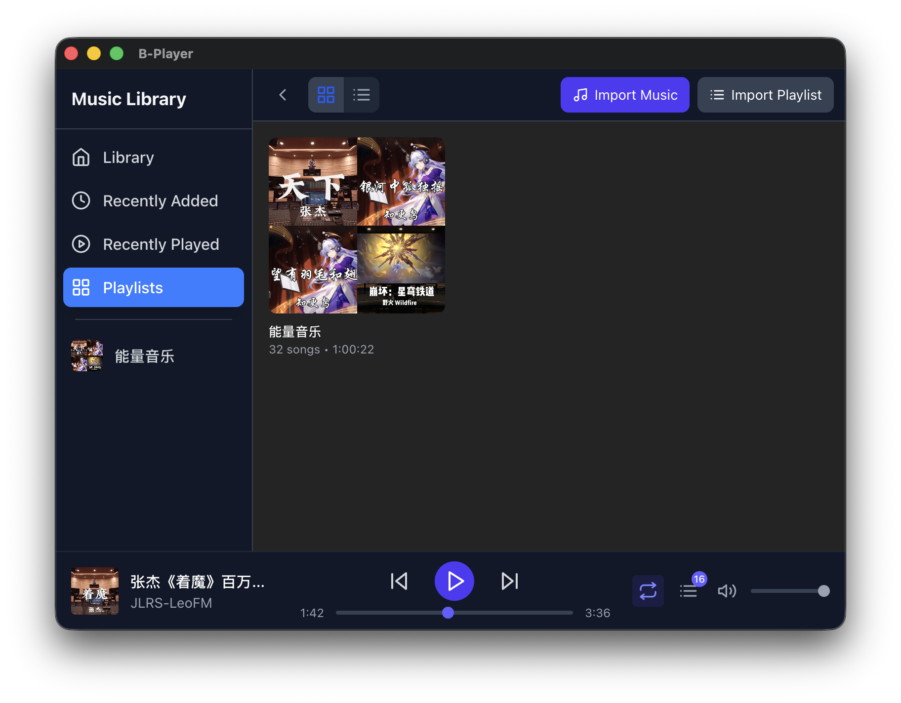
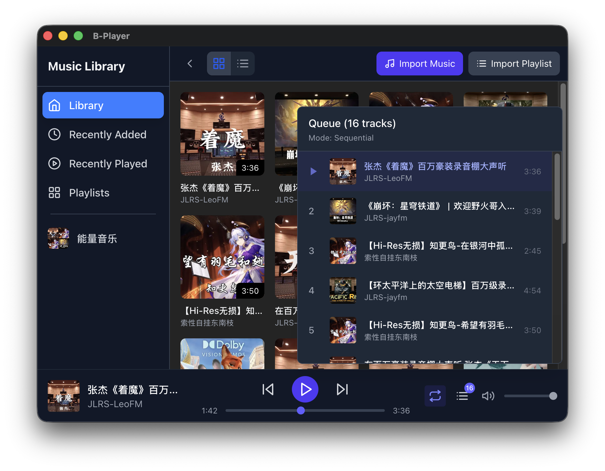

# B-Player

**Music player based on Bilibili** — A modern desktop music player with library management, playlist support, and seamless music importing from web sources.

## Quick Start

```bash
# Install dependencies
npm install

# Development mode
npm run dev

# Build for production
npm run build
```

## What is B-Player?

B-Player is a desktop music player that lets you:
- **Import music** from web sources (currently only Bilibili, with plans to include more) with a single URL
- **Organize your library** with custom playlists and smart playlists (Recently Added, Recently Played)
- **Choose your view** — switch between grid and list layouts
- **Manage your collection** — delete songs, rename playlists, pin favorites

## Key Features

### Music Import
- Paste any video/audio URL to import music
- Import entire playlists at once
- Progress tracking shows download status
- Automatic thumbnail and metadata fetching

### Library Organization
- **Library** — All your music in one place
- **Recently Added** — Tracks grouped by when you added them
- **Recently Played** — Tracks grouped by playback history
- **Custom Playlists** — Create your own collections
- **Pin Favorites** — Keep important playlists at the top



### Playlist Management
- Create custom playlists to organize your music
- Drag and drop tracks to reorder
- Rename or delete playlists
- Pin favorites for quick access



### Playback Controls
- Play/Pause, Next, Previous
- Queue management with source tracking
- Grid and list view modes
- Playback modes: sequential, loop-single, shuffle



### Right-Click Actions
- Delete songs from library or specific playlists
- Rename or delete playlists
- Open file location in explorer

## How It Works

### Architecture Overview

B-Player is built as an **Electron app**, which means it combines web technologies with desktop app capabilities:

```
┌─────────────────────────────────────────────────┐
│                  B-Player                       │
├─────────────────────┬───────────────────────────┤
│   Frontend (React)  │   Backend (Node.js)       │
│                     │                           │
│ • User Interface    │ • File System             │
│ • Playback Controls │ • Database (SQLite)       │
│ • View Modes        │ • Music Downloading       │
│                     │ • Metadata Extraction     │
└─────────────────────┴───────────────────────────┘
```

### Frontend Implementation

**What you see** is built with:
- **React** — Modern UI framework
- **Redux** — Manages app state (what's playing, current playlist, etc.)
- **Tailwind CSS** — Styling and responsive design

**State Management:**
The app keeps track of:
- Your music library and playlists
- Current playback queue and position
- Which playlist you're viewing
- Whether you're in grid or list mode
- Import progress for new music

**View Switching:**
The app doesn't use pages/routes like a website. Instead, it switches views based on what you select in the sidebar:
- Library shows all music
- Recently Added groups by import date
- Recently Played groups by last played date
- Custom playlists show their contents

### Backend Implementation

**What happens behind the scenes:**

**Database (SQLite):**
- All music metadata stored locally
- Playlist relationships tracked
- Smart playlists use date-based queries
- No cloud dependency — everything lives on your machine

**File Storage:**
```
music_storage/
└── <unique_hash>/
    ├── audio.mp3          # The actual music file
    └── thumbnail.jpg      # Cover art
```
Each song gets its own folder, identified by a unique hash. This prevents duplicates and makes cleanup safe.

**Music Import Pipeline:**
1. You paste a URL
2. Backend downloads audio using yt-dlp (best quality)
3. FFprobe extracts duration and file size
4. Web scraper fetches thumbnail and metadata
5. Files stored in hash-based directory
6. Database record created
7. UI updates automatically

**Communication:**
Frontend and backend talk via IPC (Inter-Process Communication):
- Frontend asks for data → Backend fetches from database
- Frontend imports music → Backend downloads and updates database
- Backend sends progress updates → Frontend shows loading bar

## Technology Stack

| Component | Technology |
|-----------|------------|
| App Framework | Electron |
| User Interface | React + TypeScript |
| State Management | Redux Toolkit |
| Database | SQLite (better-sqlite3) |
| Music Download | yt-dlp |
| Metadata | FFprobe |
| Styling | Tailwind CSS |
| Build Tool | Vite |

## Development

For detailed architecture, implementation patterns, and long-term knowledge, see [CLAUDE.md](./CLAUDE.md).
